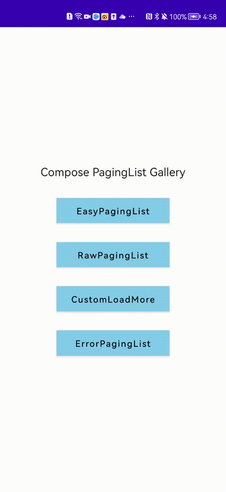
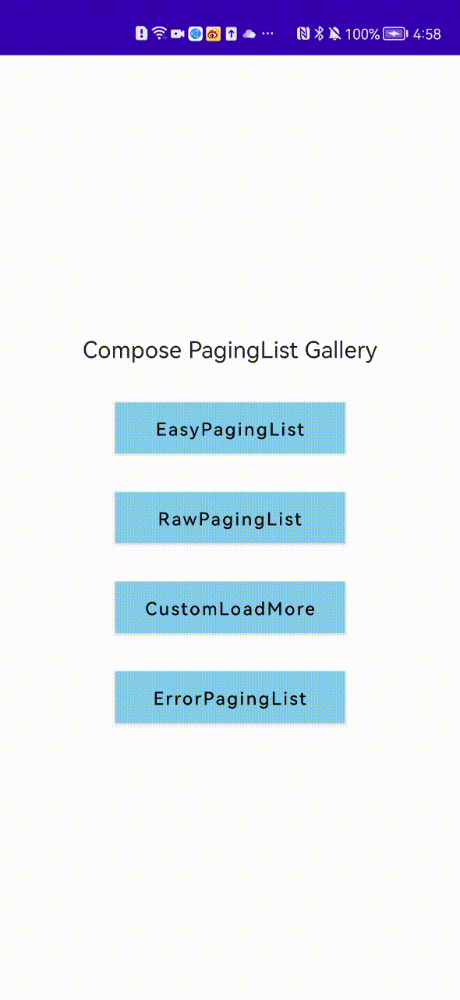

# Compose Paging List for Jetpack Compose
A library that provides several functionalities to make it easy to write a list with paging data
1. It defines methods to config Google's [Jetpack Paging Library](https://developer.android.com/topic/libraries/architecture/paging/v3-overview) easily.
2. It provides default layouts for different paging loading status.
3. It provides some composable layouts that can be used to form a paging list easily.
   
 

# Usage
To start using this library, apps need to define pager data and provide it to the list
## Pager Data
Apps can define the pager data for list in the ViewModel in several ways

1. The simplest way is to use the [easyPager](https://github.com/KevinnZou/compose-pagingList/blob/main/core-paginglist/src/main/java/com/kevinnzou/compose/core/paginglist/EasyPager.kt).
It requires the apps wrap the data in [PagingListWrapper](https://github.com/KevinnZou/compose-pagingList/blob/main/core-paginglist/src/main/java/com/kevinnzou/compose/core/paginglist/pagerconfig/PaglingListWrapper.kt) which need the data list and the hasMore sign.
```kotlin
@HiltViewModel
class MainViewModel @Inject constructor() : ViewModel() {
    val pager = easyPager {
        loadData(it)
    }

    private suspend fun loadData(page: Int): PagingListWrapper<String> {
        delay(2000)
        val data = mutableListOf("Page $page")
        repeat(20) {
            data.add("Item $it")
        }
        return PagingListWrapper(data, page < 3)
    }
}
```
2. However, the first method is only suitable for the simple data model. If you have a complex model, then you can use the [easyPager2](https://github.com/KevinnZou/compose-pagingList/blob/main/core-paginglist/src/main/java/com/kevinnzou/compose/core/paginglist/EasyPager2.kt)
```kotlin
val pager2 = easyPager2(initialKey = 0){
    return@easyPager2 loadData2(it)
}

private suspend fun loadData2(page: Int): PageListVO {
    delay(1500)
    val data = mutableListOf("Page $page")
    repeat(20) {
        data.add("Item $it")
    }
    return PageListVO(page, data, page < 2)
}
```
It requires the data model to implement the interface [IHasMoreListVO](https://github.com/KevinnZou/compose-pagingList/blob/main/core-paginglist/src/main/java/com/kevinnzou/compose/core/paginglist/pagerconfig/IHasMoreListVO.kt) to provide the list data, hasMore sign, preKey and the nextKey.
```kotlin
data class PageListVO(var page: Int, var items: MutableList<String>, var hasMore: Boolean) : IHasMoreListVO<Int,String> {
    override fun hasMore(): Boolean {
        return hasMore
    }

    override fun getList(): List<String> {
        return items
    }

    override fun getPreKey(): Int? {
        return if (page - 1 < 0) null else page - 1
    }

    override fun getNextKey(): Int? {
        return page + 1
    }
}
```
3. Lastly, the library provides the [pager](https://github.com/KevinnZou/compose-pagingList/blob/main/core-paginglist/src/main/java/com/kevinnzou/compose/core/paginglist/Pager.kt) which allows the apps to map their own defined Http Result to Kotlin Standard Result. Then it will map it to PagingSource.LoadResult automatically.
```kotlin
pager(pagerConfig, initialKey) { key ->
    when (val result = loadData(key)) {
        is HttpResult.Error.BusinessError -> {
            return@pager Result.failure(Exception("${result.code} - ${result.message}"))
        }
        is HttpResult.Error.NetworkError -> {
            return@pager Result.failure(result.error)
        }
        is HttpResult.Success -> {
            return@pager Result.success(result.response)
        }
        else -> {
            return@pager Result.failure(Exception("Other Exception"))
        }
    }
}
```
## List
This library provides several ways to write a paging list
1. The easiest way is to use [PagingLazyColumn](https://github.com/KevinnZou/compose-pagingList/blob/main/core-paginglist/src/main/java/com/kevinnzou/compose/core/paginglist/easylist/PagingLazyColumn.kt) directly
```kotlin
@Composable
fun EasyPagingListScreen(viewModel: MainViewModel = hiltViewModel()) {
    val pagerData = viewModel.pager.collectAsLazyPagingItems()
    PagingLazyColumn(pagingData = pagerData) { _, value ->
        Text(value)
    }
}
```
2. However, the method above restricts the things that apps must use a lazyColumn and cannot add header. Thus, we can use the method below to compose the list you want which also has the same funtionality
```kotlin
@Composable
fun RawPagingListScreen(viewModel: MainViewModel = hiltViewModel()) {
    val pagerData = viewModel.pager.collectAsLazyPagingItems()
    // show first loading status
    PagingListContainer(pagingData = pagerData) {
        LazyRow {
            item {
                Text(
                    text = "Raw PagingList",
                    modifier = Modifier
                        .height(40.dp)
                        .fillParentMaxWidth()
                        .padding(top = 15.dp),
                    textAlign = TextAlign.Center
                )
            }
            itemsIndexed(pagerData) { _, value ->
                PagingContent(value)
            }
            // show load more status
            itemPaging(pagerData)
        }
    }
}
```
3. The second method Wrap the LazyRow with PagingListContainer which provides the first loading status, if you want to control it by yourself, you can directly use the LazyList with itemPaging
```kotlin
@Composable
fun RawPagingListScreen(viewModel: MainViewModel = hiltViewModel()) {
    val pagerData = viewModel.pager.collectAsLazyPagingItems()
    // show first loading status
    LazyRow {
        item {
            Text(
                text = "Raw PagingList",
                modifier = Modifier
                    .height(40.dp)
                    .fillParentMaxWidth()
                    .padding(top = 15.dp),
                textAlign = TextAlign.Center
            )
        }
        itemsIndexed(pagerData) { _, value ->
            PagingContent(value)
        }
        // show load more status
        itemPaging(pagerData)
    }
}
```

# Customization
Apps can customize the loading, no more, error content and so on.

<div align=left></div>

```kotlin
@Composable
fun <T : Any> PagingLazyColumn(
    modifier: Modifier = Modifier,
    pagingData: LazyPagingItems<T>,
    loadingContent: @Composable (() -> Unit)? = { DefaultLoadingContent() },
    noMoreContent: @Composable (() -> Unit)? = { DefaultNoMoreContent() },
    errorContent: @Composable ((retry: (() -> Unit)?) -> Unit)? = { retry ->
        DefaultErrorContent(
            retry
        )
    },
    refreshingContent: @Composable (() -> Unit)? = { DefaultRefreshingContent() },
    firstLoadErrorContent: @Composable ((retry: (() -> Unit)?) -> Unit)? = { retry ->
        DefaultFirstLoadErrorContent(
            retry
        )
    },
    emptyListContent: @Composable (() -> Unit)? = { DefaultEmptyListContent() },
    pagingItemContent: @Composable (index: Int, value: T?) -> Unit,
)
```

```kotlin
@Composable
fun CustomLoadMoreScreen(viewModel: MainViewModel = hiltViewModel()) {
    val pagerData = viewModel.pager.collectAsLazyPagingItems()
    PagingLazyColumn(
        pagingData = pagerData,
        loadingContent = { CustomLoadMoreContent() },
        refreshingContent = { CustomRefreshingContent() }) { _, value ->
        PagingContent(value)
    }
}

@Composable
fun CustomLoadMoreContent() {
    Row(
        modifier = Modifier
            .fillMaxWidth()
            .height(40.dp),
        horizontalArrangement = Arrangement.Center,
        verticalAlignment = Alignment.CenterVertically
    ) {
        LinearProgressIndicator(
            color = Color.Red,
            modifier = Modifier
                .width(100.dp)
                .height(2.dp),
        )
    }
}

@Composable
fun CustomRefreshingContent() {
    Column(
        modifier = Modifier.fillMaxSize(),
        verticalArrangement = Arrangement.Center,
        horizontalAlignment = Alignment.CenterHorizontally
    ) {
        CustomLoadMoreContent()
    }
}
```

# Download
The Current Release Version is 0.0.2. For future release, please refer to the release session of the github repository.
``` kotlin
repositories {
    mavenCentral()
}

dependencies {
    implementation("io.github.kevinnzou:compose-paginglist:<version>")
}

```

# License
Compose PagingList is distributed under the terms of the Apache License (Version 2.0). See the [license](https://github.com/KevinnZou/compose-pagingList/blob/main/LICENSE) for more information.
